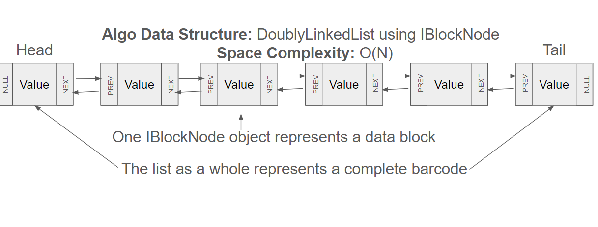

# Introduction

I have not been able to generate a working solution. This README details my approach to this problem across a couple different verticals:
- First, I will address how my algorithm works at a data structure level
- Next, I will walk through my attempts to find edge cases or interpretations I could be missing
  - A living document detailing areas I am working on and my brainstorming process is available [here](./ideas.md)
- Third, I will address my API connection architecture and controller methods here
- Finally, I will address next steps for this project that I would have wanted to execute

## Algorithm: Data Structure and General Approach

For this exercise, I have used a Doubly Linked List in order to solve any given challenge.

### IBlockNode objects

IBlockNode Objects represent a node in a Linked list of block nodes. Each contains the contents of one "block" in a barcode. An entire list corresponds to one barcode.

IBlockNode Objects support the following functions:

- Getters + Setters for previous and next notes
- reverse(): Reverses the string value of a block node
- encrypt(): encrypts the value of a block node
- solve(): parses the data block, and calls any necessary functions on the previous node
- toString(): returns the current String value of the data block
- getOriginal(): returns the original value of the data block

### Solve Sequence

First, the IBlockNode list is initialized by splitting challenge strings on '#' delimiter, and parsing each block into the constructor of a node.
Previous and next fields are set iteratively.

Next, my program iterates over the list, calling solve() on each node. This step is demonstrated in the graphic below, where "current" represents the current node being "solved".

A final iteration is executed calling "toString", and values of the list are accumulated.

## My efforts to solve for the server

I have been able to **generate** (haha) several solutions that solve the test case given in the problem statement. Unfortunately, I haven't been able to find a solution that has been accepted by the server.
Because I have not been able to find a correct solution, I have written my program in a way that is demonstrates my different attempts. Each attempt is described by a Strategy enum, and is implemented in a different class extending the BlockNode class.
When my program is run, each strategy will be executed until either a correct solution is found, or all strategies have been exhausted.

### Strategy 1: Basic Interpretation
My first strategy is, in my mind, a "basic" interpretation of the problem. 
- When nodes are repeated, the raw text of the previous node is simply appended to the current node in place of the ! character
- Blocks follow the standard encryption pattern
- Special characters are processed as they occur

### Strategy 2: ZeroEncrypt
My next strategy is based on ambiguity in the following sentence from the problem statement: "If a digit in the data block is 0, it remains unchanged."
- In the ZeroEncrypt strategy, any block **containing** a 0 is not encrypted

### Strategy 3: RepeatFullNode
This strategy repeats the previous node as a distinct data block, instead of including the string in the current node being processed
It should be noted that this strategy can be disproven by the given test case, which I realized in testing. I decided to include in my submission regardless.

### Strategy 4: RepeatTags

### Strategy 5: PostProcessing
In this strategy, special characters are processed after all numbers in a block have been set, therefore changing the position of repeated strings within a node.

## Connection Handling
For this project, I used the HTTP Client, HTTP Response, and jackson library to parse, build, and send API requests.
I will be the first to admit that this class is **NOT** properly tested, and I have been relying on print statements for I/O validation.
Due to a lack of testing, I somewhat suspect that my connection handling is the source of my bug.

## Next Steps and things I should have done differently
- Full Mock testing of the ConnectionHandler class
- Add a strategy that does NOT filter out invalid input
- Implement "combination" strategies, combining different interpretations of encrypt, repeat, and reverse.
  - This would require a design change to function objects being passed as arguments to a generic BlockNode object, to avoid n Choose 3 classes being created.
  - I should have started with this design, as it would have allowed me greater flexibility in the number of strategies I was able to test.